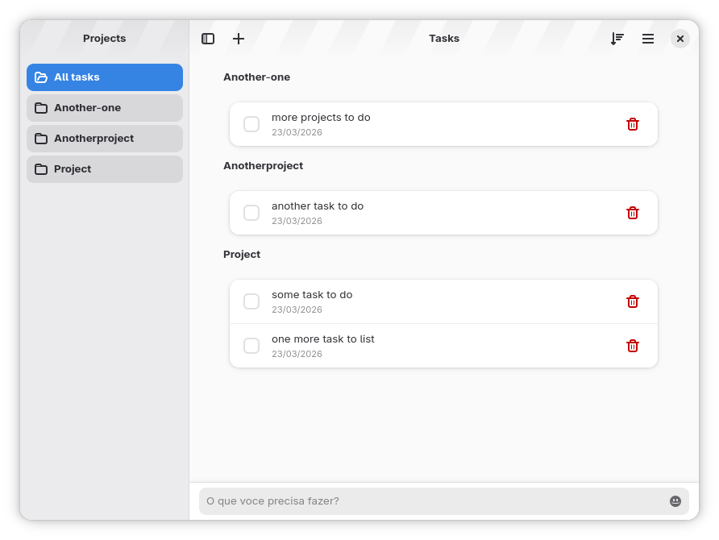
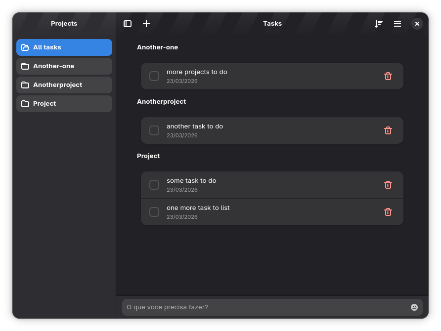

# ✅ Do It

This is a **deadly simple task manager**. Over the years I have used a lot of to-do tools: from the OG Wunderlist (later Microsoft To Do) to GNOME Tasks & Trello, Notion, etc.

All of them marvelous, some of them abandoned, but none of them as simple as I wanted.
Too many subtasks, links, categories and options. So I decided to build my own.

All I want was an app to pop up, write down a simple task and _done_. None of
them has a small footprint to use it this way, nor fit perfectly my requirements.

✨ **Do It** is my solution. I just type a task, mark a project and hit <kbd>Enter</kbd>. Then I can edit, mark done or delete it whenever I want.

| Light Mode                      | Dark Mode                     |
| ------------------------------- | ----------------------------- |
|  |  |

## ✨ Features

> 🖥️ This app is built to the GNOME Desktop Environment, with GTK4 and Adwaita.

- Offline-first
- Simple layout
- Distributed by **Flatpak**
- Built with **Typescript**

As an offline-first app, there is no synchronization features. Only import and export features are available.

I do plan to add synchronization features in the future, but probably as a paid feature. The core app will always be free and open source. Any _paid_ features will be additional and optional, under a different license and agreement.

### Simple management

There is only one single focus: _handle my tasks_. The following actions are essential, assembling the application core:

- ✏️ Write down a task (and assing a project with `@project-name`)
- 🏷️ Automagically group by projects
- ✅ Mark as Done directly from thelist
- ✍️ Edit any property afterwards
- 🗑️ Or mark a task as deleted
- 🧹 Clean up and purge all deleted tasks
- ↕️ Sort your tasks with a range of options

### Offline-first, privacy-oriented

This app does not have any tracking and/or analytics scripts. This means that
the only way to give a feedback is contact author by using our
[Discussions threads](https://github.com/andrepg/do-it/discussions).

You can give suggestions, ask for help and start usefull pools to the community.
Before opening a bug is always welcome to search your problem in the Discussions first.

### Your data is yours

All your data is stored locally on your device. You can export and import your data (in JSON format) at any time.
The task format follows the [ITask](https://github.com/andrepg/do-it/blob/main/src/app.types.ts) interface, being:

| Property   | Type       | Description                                 |
| ---------- | ---------- | ------------------------------------------- |
| id         | `number`   | Task id                                     |
| title      | `string`   | Task title                                  |
| created_at | `number`   | Task creation date, in milliseconds         |
| project    | `string`   | Task project                                |
| tags       | `string[]` | Task tags, if any, as in `['tag1', 'tag2']` |
| deleted    | `boolean`  | Task deleted status                         |
| done       | `boolean`  | Task done status                            |

## 🗺️ Roadmap & Progress

The current roadmap to this application is available in the [GitHub Project](https://github.com/users/andrepg/projects/8).

The issues and bugs can be reported in the [Issues section](https://github.com/andrepg/do-it/issues).

## 💰 Sponsored by

This repo uses a third-party ads-service. And you can sponsor this project using [GitHub Sponsors](https://github.com/sponsors/andrepg).

<!-- GitAds-Verify: I6LVITSW7RXSYY2TKEDQAN1FTRG3RSN9 -->

